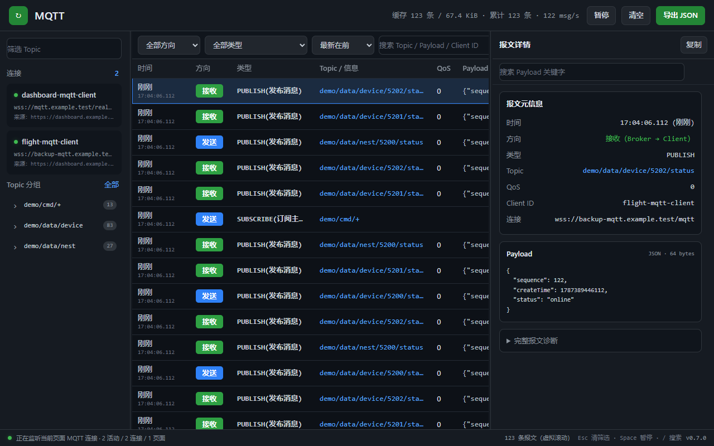

# MQTT Local DevTools

一个用于本地、测试和线上页面的 Chrome / Edge DevTools 插件。只要网页通过 `ws://` 或 `wss://` 使用 MQTT over WebSocket，就可以在 DevTools 中查看已有连接和报文；插件不会创建第二个 MQTT 客户端。



## 功能

- 展示连接地址、Client ID、MQTT 版本和连接状态
- 解析 MQTT 3.1.1 与 MQTT 5.0 常用报文
- 展示发送和接收的 CONNECT、PUBLISH、SUBSCRIBE、PING、ACK 等报文
- 展示 Topic、QoS、retain、文本/JSON Payload 和二进制十六进制预览
- 按连接、方向、报文类型和关键词筛选
- 左侧按 Topic 前三级自动分组并统计报文数，分组可展开到具体 Topic 并进行精确筛选
- Topic、报文列表、报文详情三栏均可拖动分隔线调整宽度，宽度会自动保存；方向键可微调，双击分隔线恢复默认
- 顶部实时显示报文总数和最近一秒接收速率，底部显示监听状态与快捷键
- 时间排序支持倒序（最新在前）和正序（最新在后），选择会自动保存
- 来源页面刷新时自动移除该标签页旧 session 的连接和报文，再显示重新建立的连接
- 暂停界面刷新、复制报文详情、导出 JSON
- 报文详情拆分为元信息、格式化 Payload 和可展开的完整诊断；支持关键字搜索、高亮全部匹配，并用 Enter / Shift+Enter 前后跳转
- 报文详情使用独立的浏览器原生滚动视口，支持滚轮、触控板、拖动滚动条和键盘滚动
- 高频消息以 16ms 帧级批次传输，面板约 125ms（8 FPS）合并刷新，并通过虚拟滚动只维护可视区域报文行
- 鼠标悬停、滚动和筛选输入不会暂停实时渲染；只有点击“暂停”或按 Space 才暂停界面刷新
- 所有 HTTP/HTTPS 域名和 IP 页面默认启用
- 支持 localhost、局域网 IP、公网 IP 和线上域名页面
- 本地开发页面的 MQTT 面板可聚合所有 localhost/127.0.0.1 标签页的连接，并显示来源页面；线上页面的数据按当前被检查标签页隔离

## 支持范围

| 页面环境 | 是否支持 | 说明 |
| --- | --- | --- |
| localhost / 127.0.0.1 | 支持 | 可跨本地端口聚合连接，方便同时调试多个前端页面 |
| 局域网或公网 IP | 支持 | 页面需要使用 HTTP/HTTPS，并在插件授权范围内 |
| 线上域名 | 支持 | HTTP/HTTPS 页面中的 `ws://` / `wss://` MQTT 均可监听 |
| 原生 TCP MQTT | 不支持 | `mqtt://`、`mqtts://` 不经过浏览器 WebSocket API |

无论本地还是线上，监听器都必须在页面创建 WebSocket 前注入。因此安装或重新加载插件后，需要刷新目标页面。插件不会绕过网站登录、访问控制或浏览器安全策略，只能查看当前页面自身可访问并创建的 WebSocket 数据。

## 安装

### 从 GitHub Release 安装

1. 在 [GitHub Releases](https://github.com/ganghao1024/mqtt-local-devtools/releases) 下载最新的 `mqtt-local-devtools-*-cws.zip`。
2. 解压 ZIP 文件。
3. 打开 Chrome 的 `chrome://extensions` 或 Edge 的 `edge://extensions`。
4. 开启“开发者模式”。
5. 点击“加载已解压的扩展程序”，选择刚才解压的目录。
6. 打开需要调试的本地或线上页面并刷新，然后在 DevTools 顶部选择 **MQTT** 面板。

### 从源码安装

1. 打开 Chrome 的 `chrome://extensions` 或 Edge 的 `edge://extensions`。
2. 开启“开发者模式”。
3. 点击“加载已解压的扩展程序”。
4. 选择克隆或下载后的项目根目录（该目录中应直接包含 `manifest.json`）。
5. 打开需要调试的本地或线上页面并刷新。
6. 打开浏览器开发者工具，在顶部选择 **MQTT** 面板。

插件安装时会请求所有 HTTP/HTTPS 网站的访问权限，以便在页面脚本创建 WebSocket 前注入 MQTT 监听器。

## 使用说明

插件必须在 WebSocket 创建前注入监听器，因此首次安装、重新加载插件或刚授权站点后都要刷新被调试页面。面板打开得晚也没关系：DevTools 未连接时，每个页面最多回放最近 1000 个事件且不超过 8 MiB；DevTools 已连接并实时接收后，页面回放窗口自动缩短为 200 个事件且不超过 2 MiB。任一限制先达到时淘汰最旧事件，新报文继续实时写入。

### 高频报文性能

- MQTT 接收、解析与缓存保持实时，DevTools UI 固定约 8 FPS 合并刷新，避免高频报文阻塞页面。
- 报文列表使用虚拟滚动，即使缓存 5000 条也只创建当前可视区域附近的 DOM 行。
- 连接列表与 Topic 分组使用互不覆盖的独立滚动区域；大量 Topic 展开后不会挤压或遮挡连接卡片。
- Topic 分组、缓存总数与实时速率增量维护；全局搜索文本在接收时预计算，并带约 150 ms 防抖。
- 页面侧使用自适应环形缓冲区：待机时 1000 条或 8 MiB，DevTools 已连接时缩短为 200 条或 2 MiB；DevTools 面板独立保留 5000 条或 32 MiB。

连接列表只显示已确认使用 MQTT 的 WebSocket。确认依据包括 WebSocket 子协议包含 `mqtt`，或捕获到合法的 CONNECT / CONNACK 报文。本地开发模式会跨端口聚合，例如在一个 localhost 页面打开的 MQTT 面板中，也能看到另一个 localhost 端口建立的连接；线上页面不会跨站点聚合。

### 安全与隐私

- Payload、Client ID、Topic 和 WebSocket 地址不会上传到开发者或第三方服务器，只保留在当前浏览器会话内存中。
- 插件不包含账号、密码、API Key、遥测上报或远程代码。
- 点击“导出 JSON”时，数据才会由浏览器下载到本地；导出内容可能包含业务 Payload，请自行妥善保管。
- 插件只观察当前页面使用 WebSocket API 收发的数据，不劫持连接，也不会读取其他应用或浏览器外部的 WSS 流量。

完整的数据处理说明见 [隐私政策](store-assets/privacy-policy.zh-CN.md)。

PUBLISH 报文详情和导出文件会优先展示 `payload.utf8`；如果内容是合法 JSON，还会同时生成格式化后的 `payload.json`。`rawMqttFrame.hexPreview` 仅用于诊断 MQTT 固定头、Topic 长度和原始报文边界，不应当作为业务正文直接转码。

## 当前边界

- 只能监听页面主线程创建的 MQTT over WebSocket（`ws://` / `wss://`）。
- 无法直接监控原生 TCP MQTT（如 `mqtt://broker:1883`）、Node.js 后端连接或 Android 原生插件连接。
- Web Worker、Shared Worker、Service Worker 中创建的连接暂未注入。
- 当前解析器跳过 MQTT 5 属性内容，但能正确跨过属性并解析 Topic 和 Payload。
- 单条文本 Payload 最多展示前 200,000 字节；二进制报文展示十六进制预览。

## 开发验证

项目没有第三方运行时依赖。安装 Node.js 后执行：

```powershell
npm test
npm run check
```

修改扩展代码后，需要在扩展管理页点击“重新加载”，然后刷新被调试页面。
